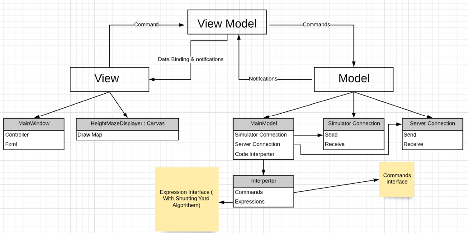
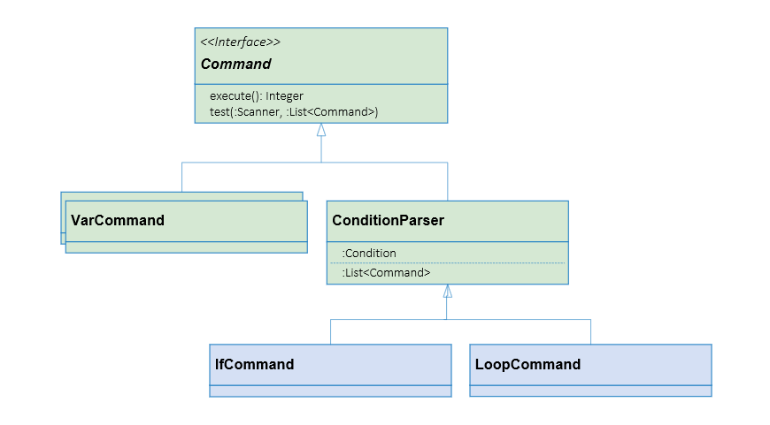
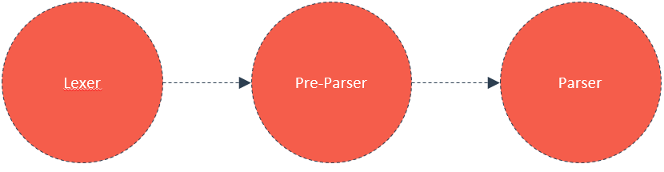
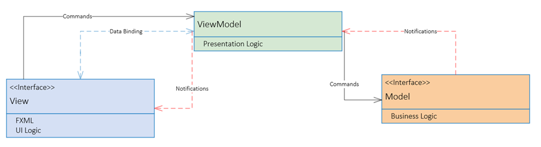

# Flight Simulator Control - Client Side 

(//add youtube link)

This is a project we developed during our advanced software programming course in our 2nd year.
This project helped us to gain a higher level of knowledge in programming, with emphasis on design patterns and programming principles such as SOLID and GRASP, and finally developing our own JavaFX desktop application.

## Client-Side


---
##   Interpreter 

As stated at the beginning of the repository, the project is a GUI of a flight simulator by which you can control the plane and get information from it.

One of its features is running a script, which is basically a kind of custom programming language that can handle the plane.

As in the following example:

```scala
openDataServer 5400 10
connect 127.0.0.1 5402
var breaks = bind "/controls/flight/speedbrake"
var throttle = bind "/controls/engines/current-engine/throttle"
var heading = bind "/instrumentation/heading-indicator/indicated-heading-deg"
var roll = bind "/instrumentation/attitude-indicator/indicated-roll-deg"
var pitch = bind "/instrumentation/attitude-indicator/internal-pitch-deg"
var rudder = bind "/controls/flight/rudder"
var aileron = bind "/controls/flight/aileron"
var elevator = bind "/controls/flight/elevator"
var alt = bind "/instrumentation/altimeter/indicated-altitude-ft"
breaks = 0
throttle = 1
var h0 = heading
sleep 5000
while alt < 1000 {
	rudder = (h0 - heading)/180
	aileron = - roll / 70
	elevator = pitch / 50
	sleep 150
}

```
For this purpose, we wrote a code reader, an interpreter, which allows you to connect to the simulator, open a server, and run various commands that control the plane and sample its data.

In the text above, we see a while loop that will take place as long as the plane’s altitude is less than a 1000 meters, the loop content will give orders to the plane's acceleration and elevation.
In this part:
```scala
rudder = (h0 - heading)/180
```
We can see that arithmetic expressions are supported as well, and to interpret them we use [Dijkstra's Shunting Yard algorithm](https://en.wikipedia.org/wiki/Shunting-yard_algorithm).

---

### Command Pattern


In this project there is an extensive use of commands, the plane needs to receive a lot of instructions in a short period of time 
in order to fly correctly. For that matter, the most suitable design pattern for the task is the Command Pattern. 
The Command Pattern implementation can be seen in our ```CompParser``` - each command in the program is receiving its own Command Object.

It is important that all commands will implement the same interface, because we want them to have a common polymorphic denominator.

Another reason to use the Command Pattern is for when we need an assembly of commands at once. For example, we needed a command that holds other different commands inside of it. In that case, we combined the **Command Pattern** with **Composite Pattern**.

So if, for example, we take a look at the "loop" command or "if" command, then we can see that each contains a list of commands which in turn can be either a standard single command or a list of commands.

---
### Interpreter stages




So this script-reader works in a very similar way to the interpreter of a real programming language.

The first stage that happens in the interpretation process is ``Lexer``.

The Lexer takes the string as it is, and converts it to a logical distribution according to commands and parameters that can run later on with a Scanner.

The next stage is the ``parser`` stage, which begins converting the "array" created by the Lexer into commands and executes them.

However, since the script is only supposed to control the plane, we don't want that the interpreter will have to deal with connecting to server and running the simulator, in case there are syntactic errors or incorrent entries that might be discovered in the middle of the script.

So, before we start running the commands, we will make sure that a ``Pre-Parser`` will pass the initial scan on the script and check for Syntax errors, such as incorrect parameters or irrational values.

---
## MVVM Architecture



In this project we chose to use the **MVVM architecture**.

We have the View layer that is responsible for the presentation, for example the 
input from the user. The View is also responsible for producing the graphics and has the code-
behind - for example, functions that are activated when we press a button, which are called
event-oriented programming.

* **Model** – Responsible for our business logic, such as algorithms and data access.
* **View Model** – It passes commands from the View to the Model, and its purpose is to
separate the View from the Model.
* **Data Binding** – We can wrap variables such as those in the View, and then when we change
something in the text, it will automatically changed in the ViewModel.

For the MVVM architecture to work, we'll have to wrap the different components together. 
This is done by the Observer Pattern, which binds the different components together, and notify them about changes that are made or needs to be made as required by the operator. 

## Built With

* [InteliJ](https://www.jetbrains.com/idea/promo/ultimate/?gclid=Cj0KCQjwuJz3BRDTARIsAMg-HxVutxHcwMpa_KlPrw8UA2my1eSfvKwwKSCfuDTuYDe8N9JIMsRCtP8aAnFqEALw_wcB) - Java IDE
* [Scene Builder](https://gluonhq.com/products/scene-builder/)  - Scene Builder 8.5.0


## Authors
* **Amnon Ashkenazy** - [LinkedIn](https://www.linkedin.com/in/amnon-ashkenazy-a1590b181/) & **Iris Kella** - [LinkedIn](https://www.linkedin.com/in/iris-kella-341549111/)
